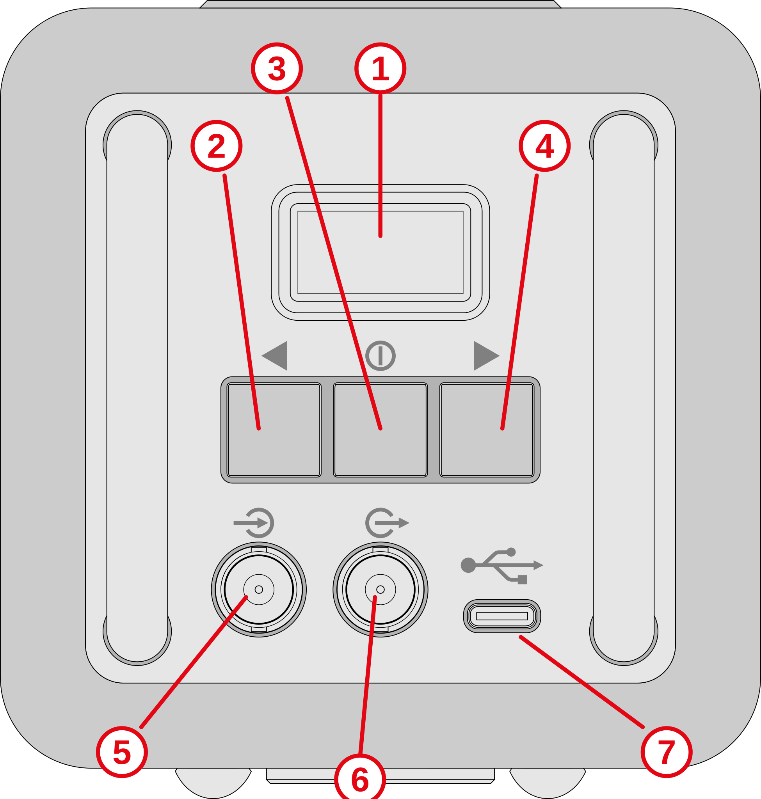
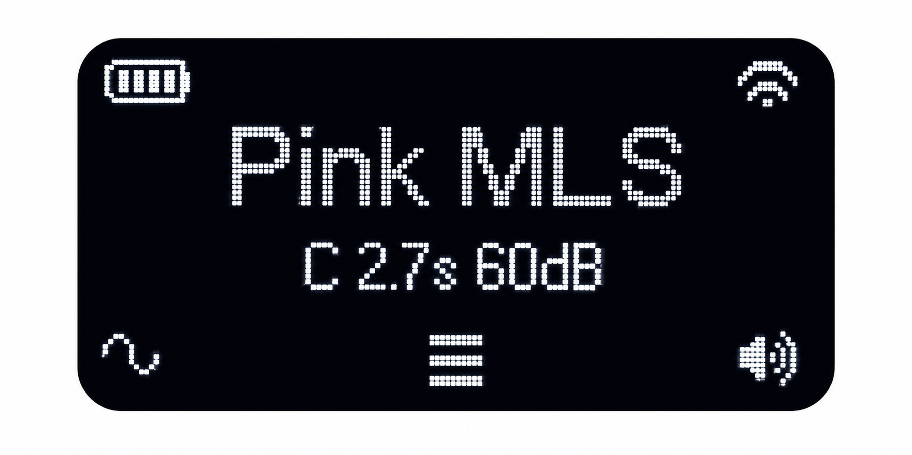

# Echo 2

The Echo 2 is a portable acoustic signal source intended for speech intelligibility measurements.
It is the successor to the B&K 4720 Speech source (Echo). The most important changes from the earlier model are an improved loudspeaker supporting a wider range of signals, a calibrated STIPA signal, advanced functionality supported by a user-friendly menu system, and WiFi based remote control.

The Echo 2 is designed to be used with the Dirac acoustics measurement software.

## Main functions

- Calibrated signal playback (PMLS, ESweep, STIPA, Speech)
- User signal playback
- BNC line input and output support
- Wi‑Fi networking
- Remote control

## User interface

| | Function |
|---|---|
| 1 | OLED Display |
| 2 | **L**eft button - Signal setup  |
| 3 | **M**iddle button - Menu |
| 4 | **R**ight button - Start/stop playback |
| 5 | BNC line level input |
| 6 | BNC line level output |
| 7 | USB-C power input |

### Display

The home page shows the battery state (upper left), Wifi state (upper right), selected signal (center), and icons for the three buttons. 

## Documentation sections

- Quick Start
- User Interface
- Signal Setup
- System Menu
- Network
- Technical Specifications
- Troubleshooting
- REST API
